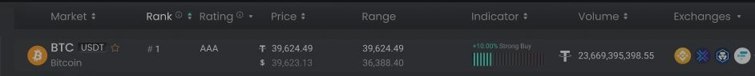

 Kassandra Markets

Kassandra Markets provides aggrogate data from supported crypto exchanges all in one place.

## Market Data
Each market will be displayed in its own row in the table as seen below.



Market rows will be populated with the data from the MarketModel.

``` C#
[
  {
    "exchange": "string",
    "data": [
      {
        "market": "string", // Two currencies in the market. 'BTC/USDT'
        "currency": "string", // Name of the currency being bought 'BTC'
        "quoteCurrency": "string", // Name of the currency being sold 'USDT'
        "currencyName": "string", // Name of the currency being traded 'Bitcoin'
        "price": 0, // Current price for the market based on the quote currency '39,624.49'
        "quotePrice": 0, // Current price of the market in the user selected quote currency '39,623.13'
        "lowPrice": 0, // Bottom price in the range '36,388.40'
        "highPrice": 0, // Top price in the range '36,388.40'
        "volume": 0, // Trade amount in the quote currency '23,669,395,398.55'
        "percentage": 0, // Percentage in the indicator column '10.00%'
        "label": "string", // Lable in the indicator column 'Strong Buy'
        "rank": 0, // Number in the rank column '1'
        "rating": "string", // Value in the rating column 'AAA'
        "exchanges": [ // Supported exchanges 'Binance, Exodus, Crypto.com, FXT'
          "string"
        ]
      }
    ],
    "time": "string"
  }
]
```